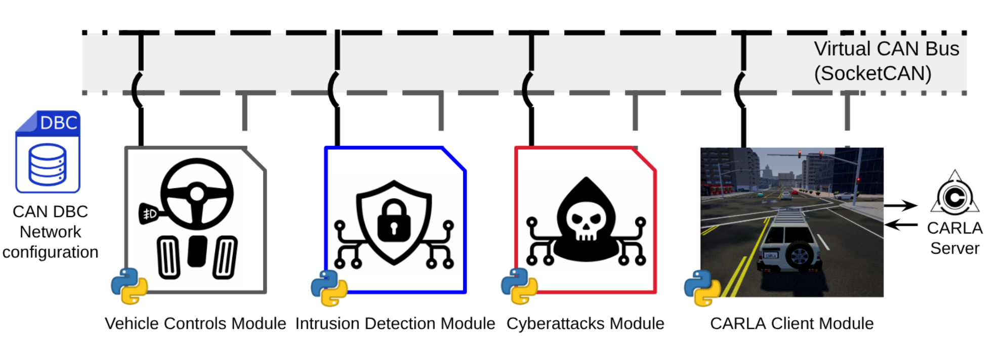
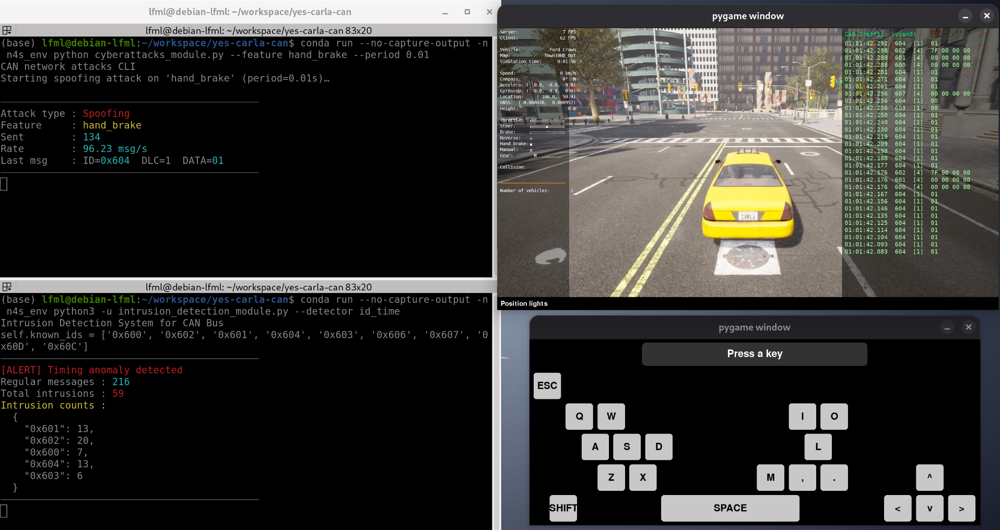
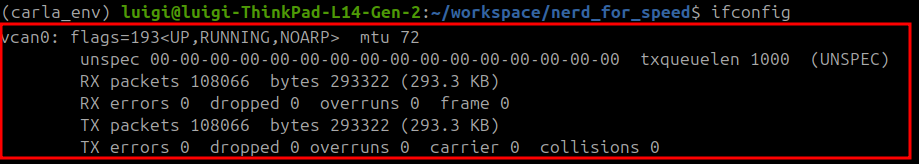
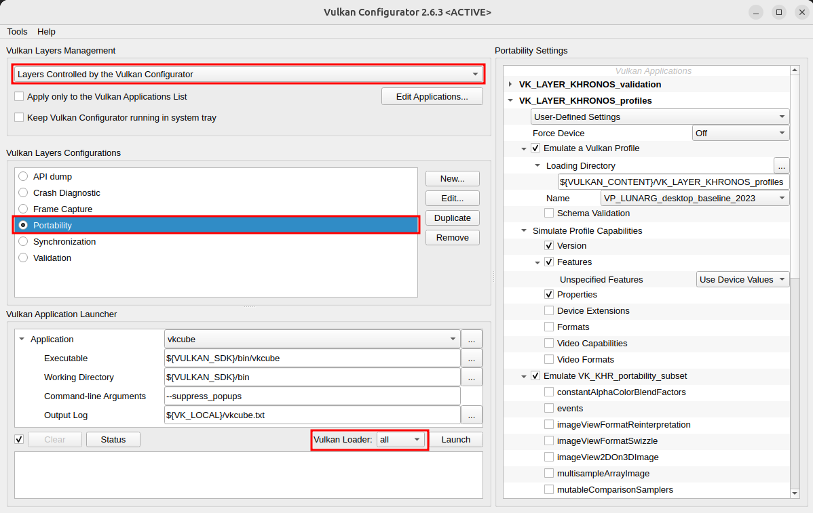
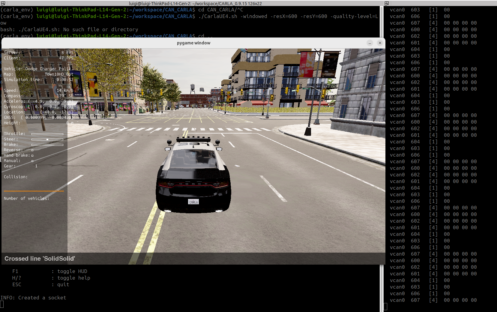
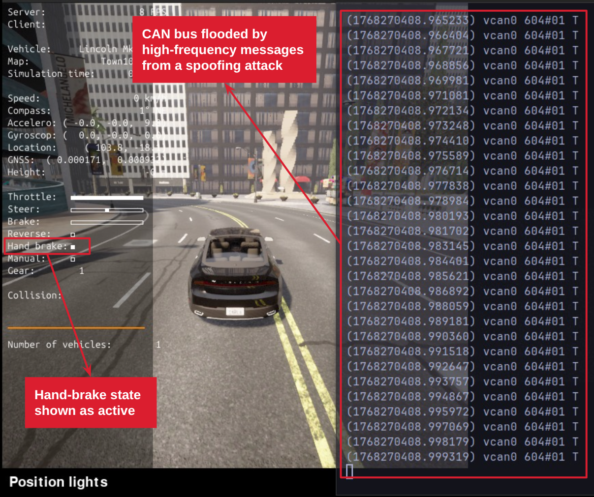
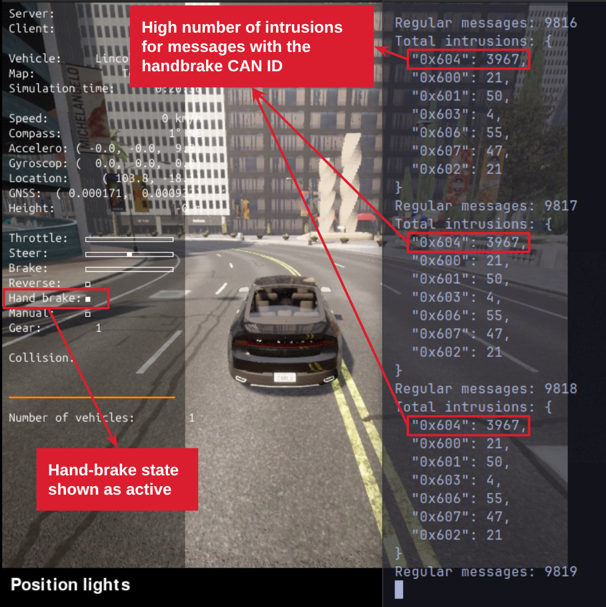

# Yes, CARLA CAN

**Yes, CARLA CAN** is an automotive cybersecurity experimentation platform that extends the [CARLA](https://carla.org/) driving simulator with a virtual [CAN bus](https://en.wikipedia.org/wiki/CAN_bus). It lets you run attack and defense experiments against a simulated vehicle network without any dedicated hardware.

This work was submitted for the Tools Session (Salão de Ferramentas) of the Brazilian Symposium on Computer Networks and Distributed Systems (SBRC) 2026 and is currently under revision.

## Architecture overview

The project architecture and its main modules are presented in the following figure:

<p align="center">
  
</p>

The platform is composed of the following modules:

- **Virtual CAN Bus (SocketCAN)** — a kernel-level virtual network interface (`vcan0`) that acts as the shared communication medium. All other modules connect to it to send or receive CAN frames, mimicking a real in-vehicle bus.
- **CAN DBC Network Configuration** — a DBC file (`data/carla.dbc`) that defines the message IDs, signal encoding, and transmission periods for the virtual network. It is the single source of truth for the CAN message schema used across all modules.
- **CARLA Client Module** (`CARLA_client_module.py`) — connects to the CARLA simulator server, spawns the ego vehicle, and attaches the sensors used in the simulation: collision, GNSS, IMU, lane invasion, and radar.
- **Vehicle Controls Module** (`vehicle_controls_module.py`) — captures keyboard inputs and translates them into CAN frames according to the DBC schema, publishing them onto `vcan0` to control the simulated vehicle.
- **Cyberattacks Module** (`cyberattacks_module.py`) — injects malicious CAN frames onto the bus. Supports Denial-of-Service (DoS) flooding and reverse-engineering-based feature spoofing (e.g. forcing hand brake or lights).
- **Intrusion Detection Module** (`intrusion_detection_module.py`) — listens to `vcan0` in real time and applies statistical detection algorithms to identify anomalous traffic patterns and raise alerts.

The network node modules (CARLA client, vehicle controls, cyberattacks and intrusion detection) run concurrently on a single machine, making experiments fully self-contained and reproducible. Each layer is also independently extensible — new attack types, detection algorithms, or vehicle configurations can be integrated by following the existing module structure.

The modules in execution will look like the ones in the following image:

<p align="center">
  
</p>

---

# README Structure

This README is organized as follows:

- [**Considered Seals**](#considered-seals): the evaluation seals being requested for this artifact submission.
- [**Basic Information**](#basic-information): hardware and software environment used to develop and test the platform.
- [**Dependencies**](#dependencies): software packages and tools required to run the platform.
- [**Security Concerns**](#security-concerns): security notes for reviewers running the artifact.
- [**Installation**](#installation): step-by-step process to download and install the platform.
- [**Minimal Test**](#minimal-test): minimal execution test to verify a successful installation.
- [**Experiments**](#experiments): step-by-step reproduction of the paper's demonstrations.
- [**LICENSE**](#license): the project's open-source license.

---

# Considered Seals

The considered seals are: Available, Functional, Sustainable, and Reproducible.

---

# Basic Information

**Hardware** (tested configuration):

| Component | Specification |
|---|---|
| **Machine** | Lenovo ThinkPad L14 |
| **CPU** | 11th Gen Intel Core i5-1135G7 @ 2.40GHz (4 cores / 8 threads, up to 4.2 GHz) |
| **RAM** | 16 GB |

**Software**:

| Component | Specification |
|---|---|
| **OS** | Ubuntu/Debian-based Linux (tested on Debian GNU/Linux 13 — Trixie) |
| **Package manager** | conda / Miniconda |
| **Python** | 3.9 |

> **Note:** All experiments were conducted on Ubuntu/Debian systems. Behaviour on Windows/WSL or macOS was not tested.

---

# Dependencies

"Yes, CARLA CAN" depends on the following software components:

| Dependency | Version | Purpose |
|---|---|---|
| **conda / Miniconda** | any | Python virtual environment management |
| **Python** | 3.9 | Runtime (required by several libraries) |
| **carla** | 0.9.15 | Python client for the CARLA simulator |
| **cantools** | see `requirements.txt` | DBC file parsing and CAN frame encoding/decoding |
| **python-can** | see `requirements.txt` | SocketCAN interface for sending/receiving CAN frames |
| **dash** | see `requirements.txt` | Web-based CAN traffic visualisation dashboard |
| **matplotlib** | see `requirements.txt` | Plotting and data visualisation |
| **scikit-learn** | see `requirements.txt` | Machine learning utilities for IDS |
| **CARLA 0.9.15** | 0.9.15 | Autonomous driving simulator (server) |
| **can-utils** | Linux system package | Kernel modules and CLI tools for the virtual CAN interface (`vcan0`) |

All Python packages are listed in `requirements.txt`. The full installation is handled automatically by the provided script — see the [Installation](#installation) section.

---

# Security Concerns

The installation and setup process requires elevated privileges (`sudo`) on the reviewer's machine for two operations:

1. **System package installation**: `0_install_dependencies.sh` calls `apt-get install can-utils`, which requires `sudo` access.
2. **Kernel module loading**: `1_up_environment.sh` loads the `vcan` Linux kernel module via `modprobe vcan` and creates a virtual network interface (`vcan0`), which also requires `sudo`.

The virtual CAN interface (`vcan0`) is entirely software-defined and isolated from any real vehicle network and from the internet. It poses no risk to physical hardware or external systems. Reviewers are advised to inspect `0_install_dependencies.sh` and `1_up_environment.sh` before running them with elevated privileges.

---

# Installation

## Step 1 — Specifying the network messages

The main contribution of this work is to bring in-vehicle network (specifically CAN network) concepts into the CARLA driving simulation. To do so, we need to define the messages that will be exchanged on the network.

Since we are working with a CAN network, we use the industry-standard CAN Database (DBC) file to specify the message parameters and transmission periods.

An example DBC file is shown below. In it, you can define the CAN ID, signal size and length, scale and offset, and minimum and maximum values. We also use the DBC attribute concept to define the custom attribute "GenMsgCycleTime", which sets the transmission period of each message. For more information on DBC file syntax, see [CSS Electronics — CAN DBC File Explained](https://www.csselectronics.com/pages/can-dbc-file-database-intro).

We provide a ready-to-use DBC file in the `data/carla.dbc` path. Running the platform as-is will use this DBC file.

```text
VERSION "1.0"
...
BU_: ECU

BO_ 1536 THROTTLE: 4 ECU
 SG_ THROTTLE_signal : 0|8@1+ (1,0) [0|255] ""  ECU

BO_ 1537 BRAKE: 4 ECU
 SG_ BRAKE_signal : 0|8@1+ (1,0) [0|255] ""  ECU

BO_ 1538 STEER: 4 ECU
 SG_ STEER_signal : 0|8@1+ (1,0) [0|255] ""  ECU
...

BA_DEF_ BO_ "GenMsgCycleTime" INT 0 10000;

BA_DEF_DEF_ "GenMsgCycleTime" 0;

BA_ "GenMsgCycleTime" BO_ 1536 100;
BA_ "GenMsgCycleTime" BO_ 1537 100;
BA_ "GenMsgCycleTime" BO_ 1538 100;
...
```

Once the DBC file is properly defined, we can move to installing the dependencies.

## Step 2 — Installing dependencies

Run the install script once. It will handle everything, prompting you only if Miniconda is not yet present:

> **Disclaimer:** All experiments were conducted on Ubuntu/Debian systems. Behaviour on Windows/WSL or Macbooks was not tested.

```bash
./0_install_dependencies.sh
```

What the script does:
1. Installs `can-utils` via `apt-get`.
2. Checks for `conda`; if absent, offers to download and install Miniconda automatically.
3. Creates the `n4s_env` conda environment with Python 3.9 (skips if it already exists).
4. Installs all Python packages from `requirements.txt` into `n4s_env`.
5. Downloads and extracts CARLA 0.9.15 into the `carla-0-9-15/` folder.

After this step, all dependencies are installed and the platform is ready to be executed.

---

# Minimal Test

Once the installation is complete, bring the core simulation up with:

```bash
./1_up_environment.sh
```

You should see an output like the following, meaning that the environment was properly brought up:

```bash
Starting CARLA simulator...
Setting up virtual CAN bus...
Waiting for CARLA to start...
4.26.2-0+++UE4+Release-4.26 522 0
Disabling core dumps.
Starting CARLA client module...
Starting vehicle controls module...
Environment is up!
```

After a few seconds, the keyboard and CARLA client window will properly appear.

#### Possible issues

<details>
<summary><strong>Check if virtualCAN was properly set up</strong></summary>

You can verify that the virtual CAN interface was created successfully:

```bash
ifconfig
```

`vcan0` should appear in the list of network interfaces:

<p align="center">
  
</p>

</details>

<details>
<summary><strong>Vulkan configuration (if the simulator fails to start)</strong></summary>

On some Ubuntu systems, CARLA may not start correctly due to graphics driver issues. Install and configure Vulkan to resolve this:

```bash
vkconfig
```

Select the configuration shown below:

<p align="center">
  
</p>

Close `vkconfig` and re-run `1_up_environment.sh`.

</details>

<br>

Internally, `1_up_environment.sh`:
1. Launches the **CARLA simulator** in headless, low-quality mode (`-RenderOffScreen -quality_level=Low`) to minimise resource usage.
2. Creates the **virtual CAN bus** (`vcan0`) using the Linux kernel `vcan` module.
3. Waits 5 seconds for CARLA to initialise.
4. Starts the **CARLA client module** (`CARLA_client_module.py`) — spawns the vehicle and sensors.
5. Starts the **vehicle controls module** (`vehicle_controls_module.py`) — translates vehicle state into CAN frames and puts them on `vcan0`.

To confirm the virtual CAN bus is active and producing traffic, run in a separate terminal:

```bash
candump vcan0
```

You should see CAN frames scrolling in real time. This will make you have three screens, one with the CARLA client, another with the vehicle controls and the third with the virtual CAN bus traffic, like in the following Figure:

<p align="center">
  
</p>

You can watch the same demonstration in the following video:

<p align="center">
  <a href="https://drive.google.com/file/d/1sZbRr9sYt1WdMqbtDC2ODVSbmgY1scZO/view">
    ▶ Watch: Keyboard-controlled vehicle driving with live CAN traffic on vcan0
  </a>
</p>

When you are done, tear everything down cleanly:

```bash
./2_down_environment.sh
```

The script stops the vehicle controls module, then the CARLA client module (waiting up to 10 seconds for a clean exit before force-killing), then the CARLA server, and finally removes `vcan0` and unloads the `vcan` kernel module.

You should see an output like the following, meaning that the environment was properly brought down:

```bash
Stopping vehicle controls module...
vehicle_controls_module (PID 10272 10291) stopped.
Stopping CARLA client module...
Waiting for CARLA_client_module (PID 10271 10292) to exit...
CARLA_client_module (PID 10271 10292) stopped.
Stopping CARLA simulator...
CARLA (PID 10158 10169) stopped.
FUnixPlatformMisc::RequestExitWithStatus
FUnixPlatformMisc::RequestExit
Bringing virtual CAN bus down...
Environment is down!
```

---

# Experiments

For all experiments below, the environment must already be up (`1_up_environment.sh` has been run). Each experiment is independent and can be stopped at any time with `Ctrl+C`.

## Claim #1 — Hand brake spoofing attack

As part of the cybersecurity experimentation, we provide a ready-to-use cyberattacks module. This module needs the same dependencies installed in the conda environment, so be sure to use it within the environment. To see the available attacks, run the following command:

```bash
conda run --no-capture-output -n n4s_env python3 cyberattacks_module.py --help
```

The output should look like the following:
```bash
CAN network attacks CLI
usage: cyberattacks_module.py [-h]
                              [--feature {hand_brake,doors,reverse,high_beam,internal_lights,low_beam,fog_lights,lights_off,position_lights,left_blink,right_blink,fuzzy,denial_of_service}]
                              [--period PERIOD]

Perform CAN network attacks.

optional arguments:
  -h, --help            show this help message and exit
  --feature {hand_brake,doors,reverse,high_beam,internal_lights,low_beam,fog_lights,lights_off,position_lights,left_blink,right_blink,fuzzy,denial_of_service}
                        Feature to attack
  --period PERIOD       Period between messages in seconds
```

This lists all available attacks. Attacks that correspond directly to a vehicle function (e.g., `hand_brake`, `doors`) are spoofing attacks targeting those features. You also need to specify `--period`, which defines the time interval between attack messages sent onto the virtual CAN network.

To perform the `hand_brake` spoofing attack, run the following command:

```bash
conda run --no-capture-output -n n4s_env python3 cyberattacks_module.py --feature hand_brake --period 0.001
```

This floods the bus with messages on CAN ID `0x604` (per the default DBC file), keeping the hand brake permanently activated in the CARLA client window, as shown below. As a result, the vehicle cannot move even if you press the throttle.

<p align="center">
  
</p>

You can also see the practical effect of the hand_brake attack in the simulated vehicle in the following video:

<p align="center">
  <a href="https://drive.google.com/file/d/1Ps3my8ZaApw0_7h0mjAC8QWvaetcpGek/view">
    ▶ Watch: Hand brake spoofing attack demo
  </a>
</p>

**Note:** To stop the attack, press `Ctrl+C` in the terminal where the command is running.

## Claim #2 — Fuzzy attack

Another available attack is the fuzzy attack, which consists of sending random valid messages at arbitrary intervals to trigger different vehicle functions. To conduct this attack, run the following command:

```bash
conda run --no-capture-output -n n4s_env python3 cyberattacks_module.py --feature fuzzy --period 0.05
```

As a result, various vehicle functions are triggered without any keyboard input. This attack is commonly used to discover vulnerabilities by mapping the effect of tampered messages across different CAN IDs. You can see the practical effect of the fuzzy attack in the video below:

<p align="center">
  <a href="https://drive.google.com/file/d/19_SIqONoN83gpm924XBQ9UwdElETfSZr/view">
    ▶ Watch: Fuzzy attack demo
  </a>
</p>

As shown in the video, once the attack starts, vehicle functions such as doors and lights are activated randomly.

## Claim #3 — Intrusion Detection System (IDS)

The intrusion detection module is extensible. The currently available algorithm is a simple statistical IDS that flags messages whose inter-arrival period deviates from the baseline. To see how to use it, run the following command:

```bash
conda run --no-capture-output -n n4s_env python3 intrusion_detection_module.py --help
```

The following help output should appear:

```bash
Intrusion Detection System for CAN Bus
usage: intrusion_detection_module.py [-h] --detector {id_time}

Intrusion Detection System for CAN Bus

optional arguments:
  -h, --help            show this help message and exit
  --detector {id_time}  Intrusion detection algorithm to use. Available options: id_time
```

To run the intrusion detection module with the available algorithm, open a separate terminal and run:

```bash
conda run --no-capture-output -n n4s_env python3 intrusion_detection_module.py --detector id_time
```

A log similar to the following will be printed periodically:

```bash
Regular messages: 455
Total intrusions: {
  "0x60d": 21,
  "0x602": 19,
  "0x603": 56,
  "0x600": 27,
  "0x606": 12,
  "0x607": 14,
  "0x60C": 3,
  "0x601": 52,
  "0x604": 30
```

This output shows the count of regular messages and detected intrusions per CAN ID. Note that this algorithm is intentionally simple and may produce false positives — users are encouraged to implement more sophisticated detection methods.

The figure below shows the IDS output during the hand brake spoofing attack described in Claim #1:

<p align="center">
  
</p>

You can also watch the previous example in runtime in the following video demo:

<p align="center">
  <a href="https://drive.google.com/file/d/1_fF2RybJRRsp1FVnU8YsbBOPj49_O76U/view">
    ▶ Watch: Intrusion detection during hand brake spoofing attack.
  </a>
</p>

You can also watch the IDS output during the fuzzy attack:

<p align="center">
  <a href="https://drive.google.com/file/d/1CyTvBQD580SP54hph-QrB7nAn1ug5aoF/view">
    ▶ Watch: Intrusion detection during fuzzy attack.
  </a>
</p>

## Claim #4 — Collecting network traffic

Beyond observing live traffic, another benefit of the virtual CAN bus is the ability to record traffic logs for further analysis. Using the built-in `can-utils` tooling, this is as simple as:

```bash
candump -l vcan0
```

This writes logs to a file named `candump-YYYY-MM-DD_HHMMSS.log`, as shown below:

```bash
cat candump-2026-03-28_133445.log
(1774715685.861121) vcan0 606#00
(1774715685.877301) vcan0 600#00000000
(1774715685.877363) vcan0 601#00000000
(1774715685.877398) vcan0 602#7F000000
(1774715685.941147) vcan0 603#01
(1774715685.941226) vcan0 604#00
```

Such logs can be used for traffic analysis and as training data for machine learning-based intrusion detection systems. As future work, we plan to generate automatically labeled captures to further support machine learning experiments.

---

# LICENSE

This project is licensed under the MIT License.

```
MIT License

Copyright (c) 2025 Luigi Luz

Permission is hereby granted, free of charge, to any person obtaining a copy
of this software and associated documentation files (the "Software"), to deal
in the Software without restriction, including without limitation the rights
to use, copy, modify, merge, publish, distribute, sublicense, and/or sell
copies of the Software, and to permit persons to whom the Software is
furnished to do so, subject to the following conditions:

The above copyright notice and this permission notice shall be included in all
copies or substantial portions of the Software.

THE SOFTWARE IS PROVIDED "AS IS", WITHOUT WARRANTY OF ANY KIND, EXPRESS OR
IMPLIED, INCLUDING BUT NOT LIMITED TO THE WARRANTIES OF MERCHANTABILITY,
FITNESS FOR A PARTICULAR PURPOSE AND NONINFRINGEMENT. IN NO EVENT SHALL THE
AUTHORS OR COPYRIGHT HOLDERS BE LIABLE FOR ANY CLAIM, DAMAGES OR OTHER
LIABILITY, WHETHER IN AN ACTION OF CONTRACT, TORT OR OTHERWISE, ARISING FROM,
OUT OF OR IN CONNECTION WITH THE SOFTWARE OR THE USE OR OTHER DEALINGS IN THE
SOFTWARE.
```
